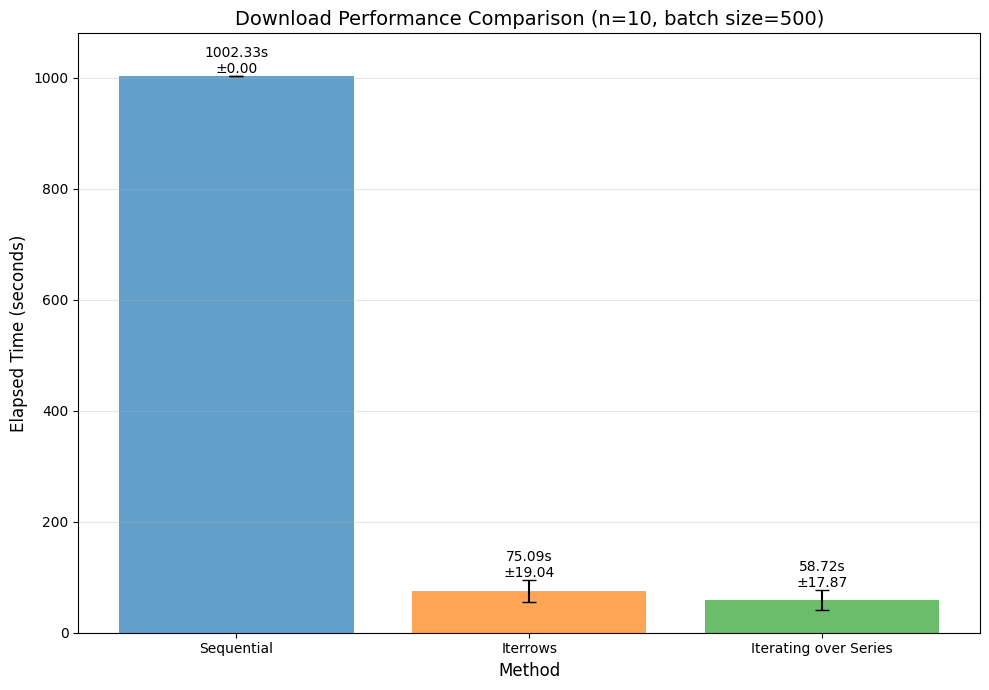

# PDF Downloader

A concurrent PDF downloader demonstrating performance optimization and parallel processing techniques in Python. Downloads PDFs from Excel data sources with fallback URLs.

## Description


Processing time for the first 500 URLs across three approaches. Sequential mode was run once due to time constraints. The two subsequent methods both used multithreaded execution via concurrent.futures.ThreadPoolExecutor and were repeated 10 times on the same 500 URLs. The key difference lies in their iteration methods: iterrows() includes all DataFrame columns during iteration, while items() iterates over a single column only.

### Key Features
- **Concurrent downloads** - using ThreadPoolExecutor
- **Sequential mode** - for comparison and benchmarking
- **Batch Processing** - and skips previously attempted downloads based on a log file
- **URL fallback** - tries secondary URL if primary fails
- **Status logging** - tracks success/failure with HTTP status codes
- **Performance benchmarks** - comparing iterrows vs. iterating on data series

### Project Structure
```
.
├── config.py              # Configuration and paths
├── download_files.py      # Main download logic
├── docs/                  # Project description, powerpoint
├── data/                  # Input Excel files
│   └── GRI_2017_2020.xlsx
├── downloads/             # Downloaded PDFs (created automatically)
├── logs/                  # Download status tracking (created automatically)
│   └── log.json
└── benchmarks/            # Performance test results
    ├── benchmarks_sequential.json
    ├── benchmarks_iterrows.json
    └── benchmarks_pandas_vectorization.json
```

## Getting Started

### Dependencies
- Python >= 3.13
- pandas >= 2.3.3
- requests >= 2.32.5
- openpyxl >= 3.1.5

### Installation

The project uses [uv](https://docs.astral.sh/uv/getting-started/installation/) for dependency management.

```bash
git clone https://github.com/JuFo96/pdf-downloader-multithreading
cd pdf-downloader-multithreading
uv sync
```

Alternatively, using pip and venv:
```bash
python3 -m venv .venv
pip install -r requirements.txt
source .venv/bin/activate # ./venv/Scripts/activate
```

## Usage

### Basic Usage
```bash
uv run download_files.py
```

The script will:
1. Load Excel data and extract URLs from primary and secondary columns
2. Filter for valid URLs and skip previously attempted downloads (tracked in `logs/log.json`)
3. Concurrently send GET requests to primary URLs, fallback to secondary if failed
4. Verify PDF content using magic bytes (check if first bytes are `%PDF-`)
5. Save valid PDFs to `downloads/` and log all outcomes with HTTP status codes

### Configuration

Edit `config.py` to modify:
- Input data file path
- Excel / Pandas columns names with urls
- Download directory
- Timeout settings
- Number of concurrent workers
- Batch size

### Status Tracking

Downloads are tracked in `logs/log.json` with the format:
```json
{
  "ID": ["success", "status_code", "url"],
  "ID124": [false, 404, "https://example.com/missing.pdf"]
}
```
### Status Codes
- **408** - Timeout
- **404** - File not found
- **403** - Access forbidden
- **415** - Invalid PDF content
- **500** - Generic request error
- **503** - Connection error


## Author

Julius Foverskov
